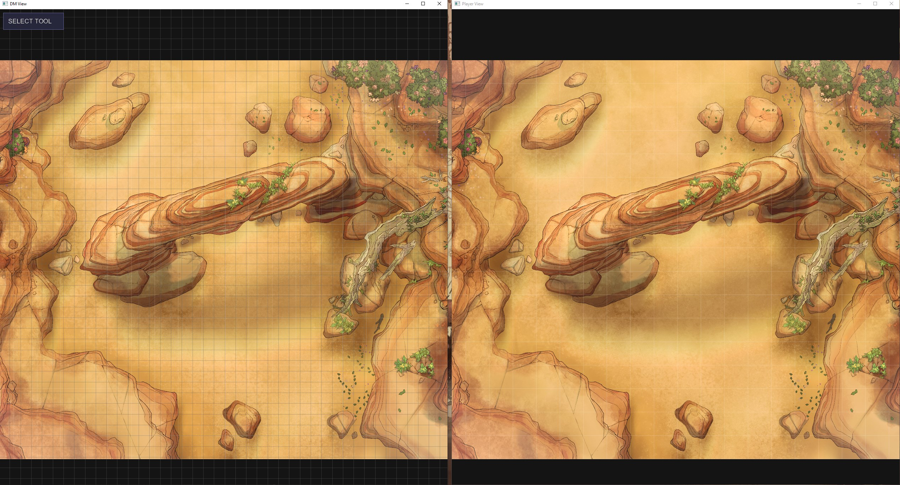
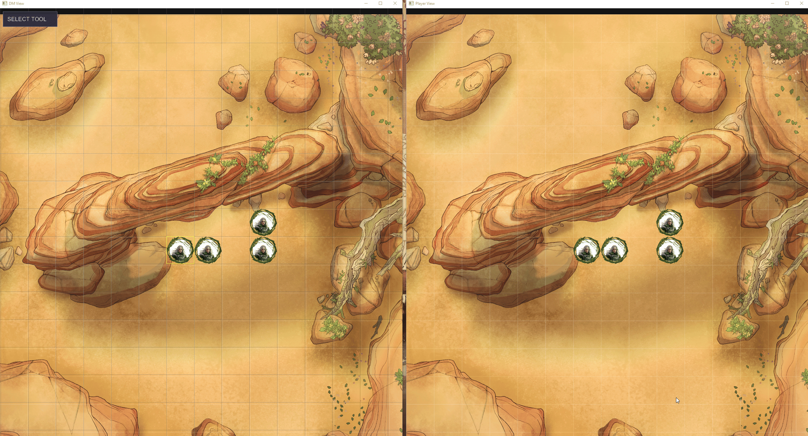
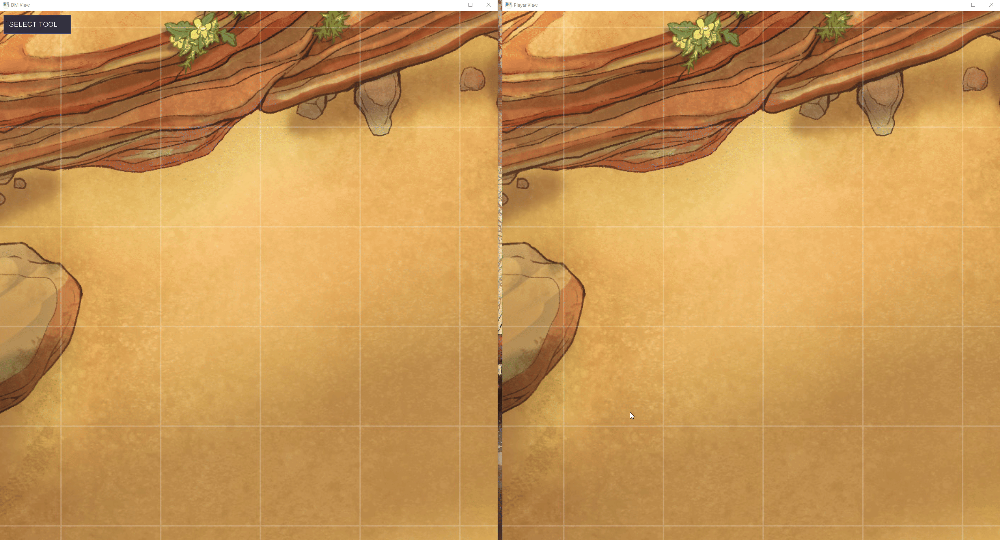

# Virtual Tabletop (VTT)

A dual-window virtual tabletop application for managing game maps, tokens, fog of war, and battle conditions. Built with SDL3 in C.



## Features

### Dual Window Display
Separate DM and player views with synchronized or independent camera controls.

### Map & Token Management
- Drag and drop support for tokens
- Multiple maps with quick switching (M key)
- Token resizing and repositioning
- Copy tokens with Shift/Ctrl + drag


### Fog of War System
Paint and reveal fog of war with intuitive brush controls. Players only see revealed areas.


###  Damage Tracking
Quick damage application with visual indicators. Supports single digit (1-9), batch (0 for 10), and pressing Enter allows custom amounts.



### Status Condition System
8 built-in conditions with color-coded visual indicators:
- **Bleeding** (Red) • **Dazed** (Gold) • **Frightened** (Purple) • **Grabbed** (Orange)
- **Restrained** (Brown) • **Slowed** (Blue) • **Taunted** (Pink) • **Weakened** (Green)


### Squad Assignment & Drawing Tools
Group tokens with color-coded borders.


### Save/Load System
Portable .vtt save files with embedded assets

### Grid Calibration
Align the grid to any map size with visual calibration tool.



## Requirements

- SDL3 library
- GCC compiler
- TrueType font file (font.ttf)
- Maps in assets/maps/ Folder in the directory of the Executable. It loads all Maps (JPEG or PNG) in that folder on startup. 
## Building

### Windows (MSYS2/MinGW)
```
build.bat
```

### Linux/Mac
```
chmod +x build.sh
./build.sh
```

## Controls

### Tools
- 1 - Select tool
- 2 - Fog of war tool
- 3 - Squad assignment tool
- 4 - Drawing tool

### Token Management
- Left click - Select/move tokens
- Shift/Ctrl + drag - Copy token
- H - Toggle token visibility
- Delete/Backspace - Remove selected token
- +/- - Resize selected token
- D - Toggle token opacity (downed 50% / normal 100%)
- Shift+D - Reset all token opacities to 100%
- A - Open condition wheel for selected token

### Damage Tracking
- 1-9 - Add damage to selected token
- Shift+1-9 - Heal (subtract damage)
- 0 - Add 10 damage
- Shift+0 - Heal 10 damage
- Enter - Type multi-digit damage value

### Condition System
- A - Open condition wheel
- Click condition to toggle on/off
- Gray conditions are active
- Conditions display as 2-letter tags on tokens

### Squad/Drawing Tools
- Q/E - Cycle through colors
- W - Cycle shape (rectangle/circle) in draw mode
- X - Clear all drawings
- Right click - Delete drawing (in draw mode)

### Camera
- Right click + drag - Pan camera
- Mouse wheel - Zoom in/out at cursor
- P - Toggle player view sync

### Map/Grid
- M - Next map
- Shift+M - Previous map
- C - Enter grid calibration mode
- G - Toggle grid overlay

### Save/Load
- Shift+F1-F12 - Save to slot
- F1-F12 - Load from slot

### General
- Esc - Deselect all / Close dialogs

## Asset Structure

```
assets/
  maps/     - Map images (PNG, JPG, BMP)
  tokens/   - Token images (PNG, JPG, BMP)
saves/      - Save files (.vtt format)
```

## Condition System

The wheel displays 8 conditions:
- Bleeding (Red)
- Dazed (Gold)
- Frightened (Purple)
- Grabbed (Orange)
- Restrained (Brown)
- Slowed (Blue)
- Taunted (Pink)
- Weakened (Green)

Active conditions appear grayed out in the wheel and display as colored 2-letter tags on tokens.

## License

This project uses stb_image.h and stb_truetype.h (public domain).
